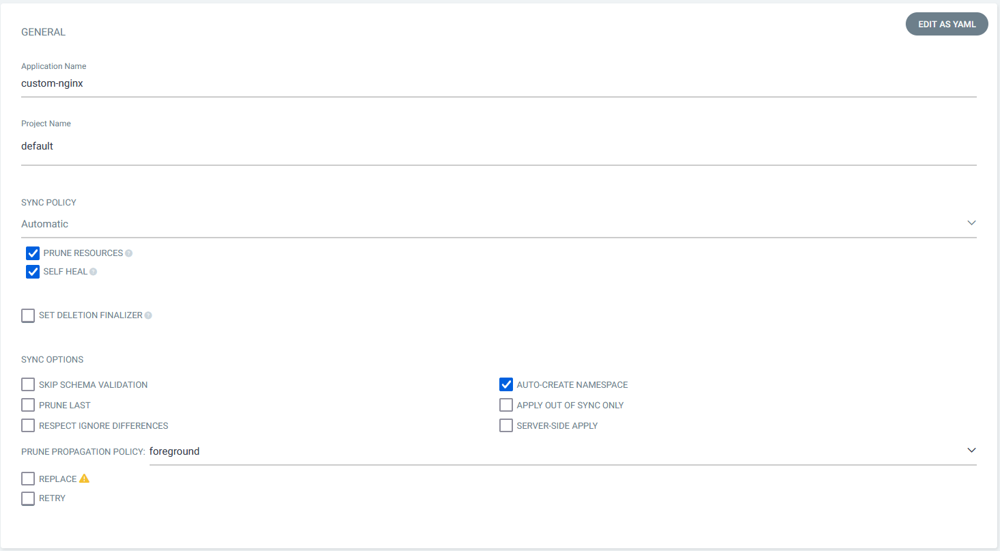
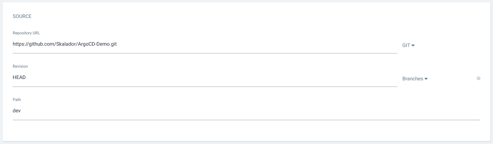
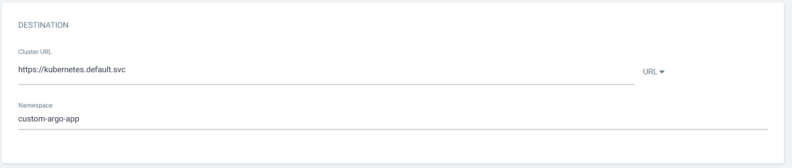
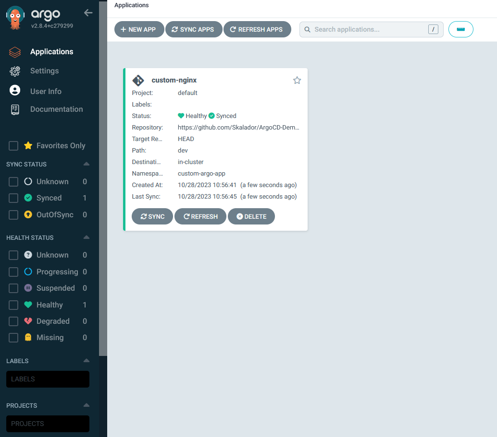
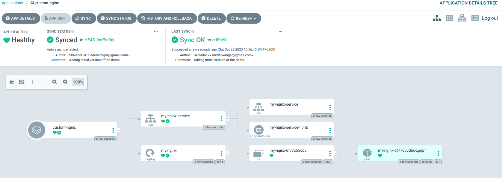
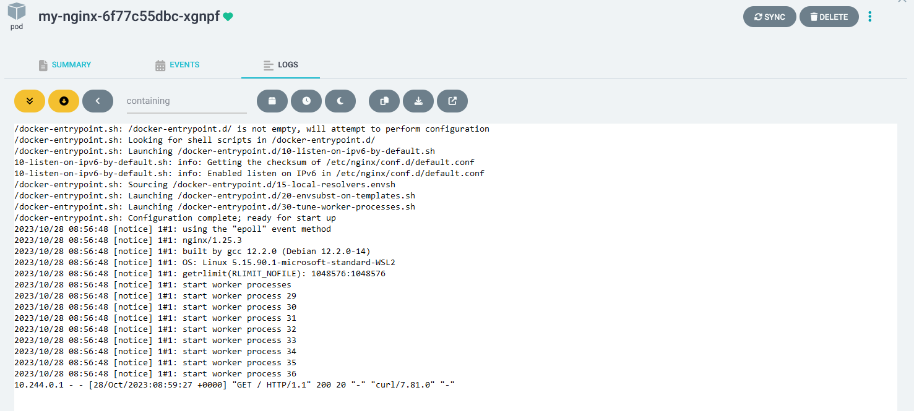

# ArgoCD-Demo

This repository is a demo for [Argo CD](https://argo-cd.readthedocs.io/en/stable/) and [Minikube](https://minikube.sigs.k8s.io/docs/). Minikube is a local instance of Kubernetes, which makes it a great fit to learn this technology and various interactions with different extensions, such as Argo CD. 

To follow the [Argo CD best practices](https://argo-cd.readthedocs.io/en/stable/user-guide/best_practices/) this repository hosts the application configuration. The application code is hosted in a separate repository [ArgoCD-Demo-Application](https://github.com/Skalador/ArgoCD-Demo-Application). 

I usually run my setup in [Windows Subsystem for Linux (WSL)](https://learn.microsoft.com/en-us/windows/wsl/install) on Windows. To have a reproducable environment refer to my [Ansible playbook for setting up WSL](https://github.com/Skalador/setup-wsl).

# Understanding the application configuration

The application configuration consists of a `deployment` and `NodePort service`. The `deployment` references one of three images from [Docker Hub](https://hub.docker.com/r/skalador/custom-nginx/tags) with the possible tags `1.0`, `1.1` and `1.2`. The tags will be rotated for the Demo. The `NodePort` exposes port `31234`, which redirects to a webserver revealing the current version of the image. 
This configuration is stored in the [dev](https://github.com/Skalador/ArgoCD-Demo/tree/main/dev) folder of the repo. 

# Setup Minikube

Start a `Minikube` cluster with
```
minikube start
```
which will automatically configure the `kubectl` command to work with the `Minikube` cluster.

# Install Argo CD

The installation of Argo is rather easy following their [getting started page](https://argo-cd.readthedocs.io/en/stable/getting_started/). This will create the `argocd` namespace and all required `CustomResourceDefinitions`(CRDs) for Argo.
```
kubectl create namespace argocd
kubectl apply -n argocd -f https://raw.githubusercontent.com/argoproj/argo-cd/stable/manifests/install.yaml
```

Wait until all pods are `Running` with
```
watch kubectl get pods -n argocd
```
# Configure Argo CD application

The configuration of the actual application can be done either via the [GUI](#configure-argo-cd-application-via-gui) or the [CLI](#configure-argo-cd-application-via-cli). For demo purposes, we anyway want to access the Argo CD web interfaces.

To keep this examples as simple as possible, we will skip the setup of an `ingress` ressource and just portforward the `argocd-server` to `https://localhost:8000`.
```
kubectl get svc -n argocd argocd-server
NAME            TYPE        CLUSTER-IP      EXTERNAL-IP   PORT(S)          AGE
argocd-server   ClusterIP   10.96.106.169   <none>        80/TCP,443/TCP   8m58s
```

For this use the `tmux` package, which allows you jump around between multiple session.
```
tmux
kubectl port-forward svc/argocd-server -n argocd 8000:443
```

Start a second session with `CTRL+B --> C`. You can jump around with `CTRL+0` and `CTRL+1` between those session. Use session `1` to obtain the default admin password from the secret `argocd-initial-admin-secret` with
```
kubectl get secret -n argocd argocd-initial-admin-secret -ojsonpath="{.data.password}" | base64 --decode && echo
```

Head to `https://localhost:8000` and login with `admin` and the corresponding initial password. 

## Configure Argo CD application via GUI

Click on `New App` and configure the `custom-nginx` application in the `default` Argo project. 

Note: Argo has a independent project structure from Kubernetes namespaces/projects.



Configure the source Git repository.



Configure the cluster destination and target namespace.



## Configure Argo CD application via CLI

To configure the Argo application apply the pre built `application.yaml`:
```
kubectl apply -f application.yaml
```
---

Both configurations will lead to the application being deployed. 



Clicking on the application will provide more detauls about the deployed Kubernetes resources. 



A nice feature of Argo CD is the availability of logs from pods.



# Verify the functionality of the application

The application has a `NodePort` service on port `31234`. The `service` will be redirected to the application running on port `80` and return the version of the application.
Verify this with the following command
```
curl http://$(minikube ip):31234
```

# Update the deployment

Updating the [deployment.yaml](https://github.com/Skalador/ArgoCD-Demo/blob/main/dev/deployment.yaml) in the Git repository from
```
image: skalador/custom-nginx:1.0
```
to
```
image: skalador/custom-nginx:1.1
```
will automatically update the deployed applications.

# Cleanup 

Remove the local Minikube instance
```
minikube delete
```
